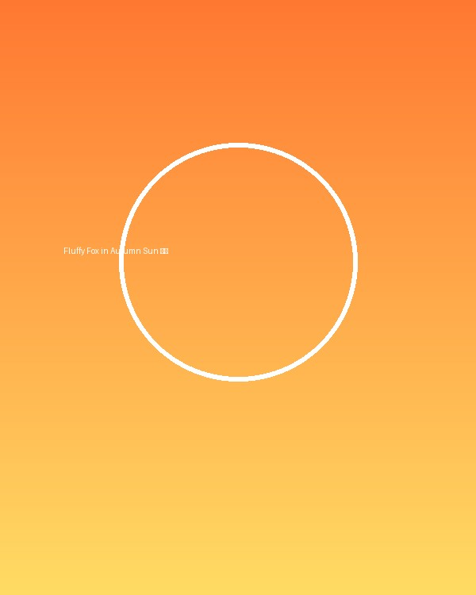

# 🪰 Drosophila Telegram Stream (FlyBrain 3D)

An interactive 3D WebGL simulator combining the **Drosophila melanogaster connectome** (*Nature* / FlyWire) with a dynamic **Telegram Feed Viewer** built in **Three.js** and **FastAPI**.



---

## ✨ Features

- **Biomechanical 3D Fruit Fly Model**: Assembled from anatomical structures of the *Google DeepMind Flybody* project (`realistic_fly.glb`) with articulated legs, translucent venated wings, and compound faceted eyes.
- **Interactive Swiping Gesture**: The fly articulates its front right leg at the coxa-thorax socket to swipe down the smartphone screen whenever a new post arrives, with simulated haptic micro-flex recoil on the phone stand.
- **Real Drosophila Connectome (FlyWire FAFB)**: Real 3D brain mesh and PAM06 / PAM11 dopamine neuron skeleton coordinates rendered in real-time.
- **PAM11 Dopamine Activity Engine**: Mathematical simulation of the fruit fly visual system (receptors L1–L3, spectral contrast, motion edges) calculating real-time firing rate in Hz and sensory spikes on an animated neon oscilloscope.
- **Any Telegram Channel Integration**: Connect any public or private channel via a Telegram Bot token to display real-time posts, titles, and member counts, with automatic fly reaction emojis posted back to Telegram.
- **Cinematic 60 FPS Camera Tour**: Smooth panoramic frontal arc choreography orbiting the fly and screen, perfect for screen capture and video recordings without mouse jitter.
- **Multiple Camera Presets**: Front, Side, Top, Isometric, and First-Person Compound Eye ("Fly Vision") mode with 780-hexagonal ommatidia optical filter.
- **Drag & Drop Local Upload**: Drop any image directly onto the 3D scene to trigger instant fly scanning and dopamine analysis.

---

## 🚀 Quick Start

### 1. Requirements
- Python 3.10+
- Modern Web Browser (Chrome, Brave, Firefox, Safari)

### 2. Installation

Clone the repository and install dependencies:

```bash
git clone https://github.com/kodzyfox/drosophila-telegram-stream.git
cd drosophila-telegram-stream
pip install -r requirements.txt
```

*(Optional: create a virtual environment first: `python3 -m venv venv && source venv/bin/activate`)*

### 3. Run the Server

```bash
python3 server.py
```
Or use the convenience script:
```bash
./run.sh
```

Open your browser at:
👉 **`http://localhost:8080`**

---

## ⚙️ Connecting Your Telegram Channel

1. Click on the **«⚙️ Бот / Канал»** (Settings) button in the top right corner.
2. Enter your **Telegram Bot Token** (obtained from [@BotFather](https://t.me/BotFather)).
3. Enter your **Channel Username** (e.g. `@my_channel`).
4. Make sure your bot is added to your channel as an administrator.
5. Click **«Проверить подключение»** and **«Сохранить»**.

The server will automatically fetch the latest posts, download the channel avatar, display the subscriber count, and stream posts onto the 3D smartphone screen!

---

## 🎮 Controls & Shortcuts

| Action | Shortcut / Control |
|---|---|
| **Rotate Camera** | Left Mouse Drag (Orbit) |
| **Pan Camera** | Right Mouse Drag |
| **Zoom** | Mouse Wheel |
| **Somersault Salto** | Click directly on the 3D fly |
| **Cinematic Mode** | `C` or click **🎬 Кино-облет** |
| **Stop Cinematic Mode** | `Esc`, click `⏹ СТОП`, or drag mouse |
| **Clean Dashboard Mode** | Click **🔲 Скрыть UI** |
| **Fly Vision Mode** | Click **👁️ Глазами мухи** |

---

## 📚 Credits & Research Sources

- **3D Biomechanical Fly Anatomy**: [Google DeepMind Flybody](https://github.com/google-deepmind/flybody)
- **Whole-Brain Connectome Data**: [FlyWire / Nature Connectome Consortium](https://flywire.ai) & [Codex](https://codex.flywire.ai)
- **3D Graphics Engine**: [Three.js](https://threejs.org/)

---

## 📄 License

MIT License. Designed for educational, research, and creative interactive web development.
